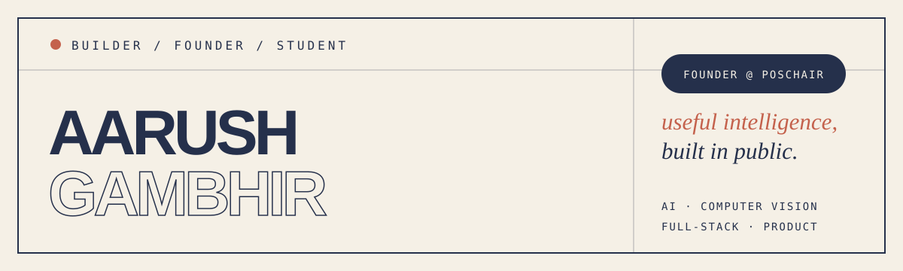

<p align="center">
  
</p>

<p align="center">
  <a href="https://www.linkedin.com/in/aarush-gambhir/"></a>
  <a href="https://github.com/Aarush22291/aarush-gambhir-portfolio"></a>
  <a href="https://github.com/Aarush22291/poschair"></a>
</p>

## Building useful intelligence

I'm **Aarush Gambhir**, an AI and computer vision developer who likes taking ideas all the way from *problem* to *working product*.

I founded **[PosChair](https://github.com/Aarush22291/poschair)**, an AI-powered posture-intelligence project that combines computer vision, machine learning, and ergonomic thinking to make work and learning environments healthier. Beyond the model, I care about the complete system: product decisions, interfaces, APIs, testing, and the story that makes the solution understandable.

- 🎯 Selected among India's **Top 20 Young Changemakers** through 1M1B × IBM SkillsBuild
- 🧠 Presented PosChair at the **IBM SkillsBuild Annual Event** and national innovation showcases
- 🚀 Reached the **EDGENOVA '26 Grand Finale — Top 25 from 150+ teams**
- 💡 IIT Roorkee E-Cell finalist, hackathon builder, and relentless prototype iterator
- 🎓 Currently building and learning at **SRM Institute of Science and Technology**

## Selected work

| Project | What it explores | Core stack |
|---|---|---|
| **[PosChair](https://github.com/Aarush22291/poschair)** | Computer-vision posture intelligence for healthier work and study environments. | TypeScript · Python · C++ · CV |
| **[Campora](https://github.com/Aarush22291/campora-smart-campus)** | A smart-campus platform designed to make student life more connected and discoverable. | TypeScript · Python · Web |
| **[Jarvis App](https://github.com/Aarush22291/jarvis-app)** | An intelligent workspace exploring useful automation and AI-first interfaces. **[Live demo ↗](https://jarvis-app-lime-chi.vercel.app)** | TypeScript · Python · AI |
| **[Paper Trader](https://github.com/Aarush22291/paper-trader-app)** | A full-stack mobile paper-trading experience with simulated trades and portfolio tracking. | React Native · Node.js · MongoDB |
| **[Rotten Fruits Identifier](https://github.com/Aarush22291/Rotten-Fruits-Identifier)** | A focused computer-vision experiment for identifying spoiled produce. | Python · Machine Learning |
| **[Portfolio](https://github.com/Aarush22291/aarush-gambhir-portfolio)** | My visual archive of projects, milestones, photographs, and certifications. | HTML · CSS · JavaScript |

## Toolkit

<p>
  
  
  
  
  
  
  
  
  
</p>

**What I enjoy:** applied AI, computer vision, full-stack engineering, product strategy, human-centered design, and the messy iteration between the first prototype and something genuinely useful.

## GitHub at a glance

<p align="center">
  
  
</p>

<p align="center">
  
</p>

## Currently

```text
Building     PosChair and practical AI products
Learning     Deeper computer vision, systems, and product engineering
Exploring    Health-tech, ergonomics, smart campuses, and agentic interfaces
Open to      Collaborations, ambitious ideas, and builder conversations
```

<p align="center">
  <strong>Observe deeply. Prototype quickly. Measure honestly. Improve relentlessly.</strong>
</p>

